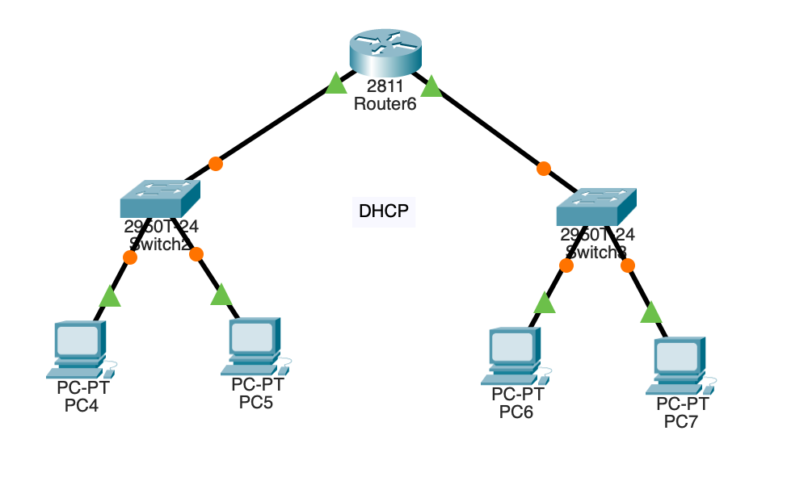
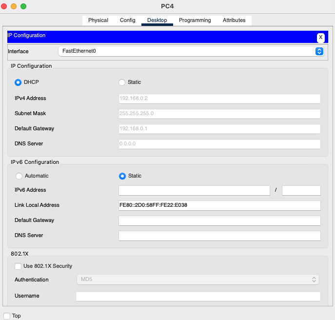
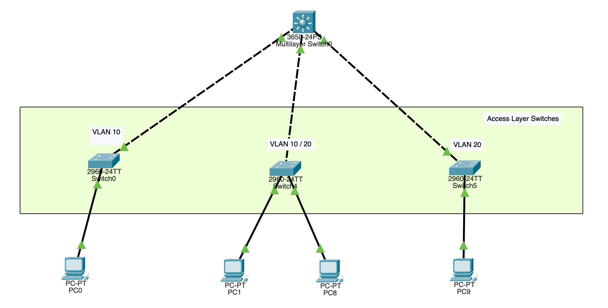

# Cisco Packet Tracer Intro

Try with
3560-24PS

## Topology



## Basic Device setup

* Add Clients
* Add Switch: 2960-24TT
* Add Router: 2811
* Use Copper to connect Clients and Switch (Fa0, Fa0/1)
* Use Copper to connect Clients and Switch (Fa0, Fa0/2)

## Configuration

### Set up router for dhcp

On the router, configure interface fa0/0 to act as the default gateway for our LAN.

```
Router>enable
Router#config terminal
Router(config)#int fa0/0
Router(config-if)#ip add 192.168.0.1 255.255.255.0
Router(config-if)#no shutdown
Router(config-if)#do write memory
Router(config-if)#exit
```

Configure DHCP server on the Router. In the server we will define a DHCP pool of IP addresses to be assigned to hosts, a Default gateway  for the LAN and a DNS Server (optional).

```
Router(config)#
Router(config)#ip dhcp pool net1
Router(dhcp-config)#network 192.168.0.0 255.255.255.0
Router(dhcp-config)#default-router 192.168.0.1
Router(dhcp-config)#exit
Router(config)#

Router(config)#
Router(config)#ip dhcp pool net2
Router(dhcp-config)#network 192.168.1.0 255.255.255.0
Router(dhcp-config)#default-router 192.168.1.1
Router(dhcp-config)#exit
Router(config)#
```

We can add ip dhcp excluded-address command to our configuration so as to configure the router to exclude addresses 192.168.0.1 through 192.168.0.10 when assigning addresses to clients:
```
Router(config)#ip dhcp excluded-address 192.168.1.1 192.168.1.10
```

### Client Setup

Click PC1->Desktop->IP configuration. Then enable DHCP:




## VLAN Configs

Source: [Link](https://www.youtube.com/watch?v=14--qiy1rsI)
Add Powersupply to Layer 3 Switch, in this example **3650-24PS**

### Topology



### Configuration

Configuration for Layer 2 Switches (Access Layer) in this example with: **2960-24TT**

```
# Enable Access Port which connects to pc
Switch>enable
Switch#config terminal
Enter configuration commands, one per line.  End with CNTL/Z.
Switch(config)#vlan 10
Switch(config-if)#int fa0/1
Switch(config-if)#switchp
Switch(config-if)#switchport mode access
Switch(config-if)#switchport access vlan 10


# Enable Trunk Port which connects to layer 3 switch
Switch>enable
Switch#config terminal
Enter configuration commands, one per line.  End with CNTL/Z.
Switch(config)#int fa0/2
Switch(config-if)#switchport mode trunk

Switch(config-if)#
%LINEPROTO-5-UPDOWN: Line protocol on Interface FastEthernet0/2, changed state to down

%LINEPROTO-5-UPDOWN: Line protocol on Interface FastEthernet0/2, changed state to up

Switch(config-if)#exit
Switch(config)#do write
Building configuration...
[OK]

```

Layer 2 Switch which manages two vlans
```
Switch>enable
Switch#config terminal
Enter configuration commands, one per line.  End with CNTL/Z.
Switch(config)#vlan 10
Switch(config-vlan)#vlan 20
Switch(config-vlan)#exit

# Ports
Switch(config)#int fa0/1
Switch(config-if)#switchport mode access
Switch(config-if)#switchport access vlan 10
Switch(config-if)#exit
Switch(config)#int fa0/2
Switch(config-if)#switchport mode access
Switch(config-if)#switchport access vlan 20
Switch(config-if)#exit
Switch(config)#do write
Building configuration...
[OK]
Switch(config)#


# Trunk Port
Switch#config terminal
Switch(config)#int fa0/3
Switch(config-if)#switchport mode trunk
Switch(config-if)#exit
Switch(config)#do write
Building configuration...
[OK]

```

Configurating the Layer 3 Trunks
```
Switch>enable
Switch#config terminal
Enter configuration commands, one per line.  End with CNTL/Z.
Switch(config)#int range gig1/0/1-3
Switch(config-if-range)#switchport mode trunk
Switch(config-if-range)#exit
Switch(config)#do write
Building configuration...
Compressed configuration from 7383 bytes to 3601 bytes[OK]
[OK]
```

Enable Inter VLAN Routing on the Layer 3 Switch
```
Switch>enable
Switch#config terminal
Switch(config)#vlan 10
Switch(config-vlan)#vlan 20
Switch(config-vlan)#exit
Switch(config)#int vlan 10
Switch(config-if)#
%LINK-5-CHANGED: Interface Vlan10, changed state to up

%LINEPROTO-5-UPDOWN: Line protocol on Interface Vlan10, changed state to up

Switch(config-if)#ip add 192.168.1.1 255.255.255.0
Switch(config-if)#no sh
Switch(config-if)#exit
Switch(config)#int vlan 20
Switch(config-if)#
%LINK-5-CHANGED: Interface Vlan20, changed state to up

%LINEPROTO-5-UPDOWN: Line protocol on Interface Vlan20, changed state to up

Switch(config-if)#ip add 192.168.2.1 255.255.255.0
Switch(config-if)#no shutdown
Switch(config-if)#exit
Switch(config)#
Switch#
```

Configurating DHCP on the Layer 3 Switch
```
Switch#enable
Switch#config terminal
Enter configuration commands, one per line.  End with CNTL/Z.
Switch(config)#service dhcp
Switch(config)#ip dhcp pool VLAN10
Switch(dhcp-config)#network 192.168.1.0 255.255.255.0
Switch(dhcp-config)#default-router 192.168.1.1
Switch(dhcp-config)#dns-server 192.168.1.1
Switch(dhcp-config)#exit
Switch(config)#ip dhcp pool VLAN20
Switch(dhcp-config)#network 192.168.2.0 255.255.255.0
Switch(dhcp-config)#default-router 192.168.2.1
Switch(dhcp-config)#dns-server 192.168.2.1
Switch(dhcp-config)#exit
Switch(config)#
```

ENABLE Routing on the layer 3 switch
```
Switch(config)#ip routing
Switch(config)#do write
Building configuration...
Compressed configuration from 7383 bytes to 3601 bytes[OK]
[OK]
```

## Firewall

[Source](https://www.youtube.com/watch?v=Lyc_EXEhJsk)

Hints to solve the [Problem](https://community.cisco.com/t5/switching/how-to-configure-multiple-vlans-on-a-firewall-with-a-l3-switch/td-p/4583434)

Security Levels
* 100 -> Inside network which is trusted
* 0 -> Nothing is trusted, high level security

```
ciscoasa#
ciscoasa#conf t
ciscoasa(config)#hostname PERIMETER-FW
PERIMETER-FW(config)#exit
PERIMETER-FW#config t
PERIMETER-FW(config)#int gig1/1 
PERIMETER-FW(config-if)#no shut

PERIMETER-FW(config-if)#int gig1/2
PERIMETER-FW(config-if)#no shut

PERIMETER-FW(config-if)#int gig1/1
PERIMETER-FW(config-if)#ip add 192.168.1.1 255.255.255.0
PERIMETER-FW(config-if)#nameif INSIDE
INFO: Security level for "INSIDE" set to 0 by default.
PERIMETER-FW(config-if)#security-level 100
PERIMETER-FW(config-if)#exit
PERIMETER-FW(config)#int gig1/2
PERIMETER-FW(config-if)#ip add 10.0.0.1 255.255.255.0
PERIMETER-FW(config-if)#nameif DMZ
INFO: Security level for "DMZ" set to 0 by default.
PERIMETER-FW(config-if)#security-level 70
PERIMETER-FW(config-if)#
PERIMETER-FW(config-if)#exit
# 'write memory' in firewalls is the same like 'do write' in routers
PERIMETER-FW(config)#wr mem
Building configuration...
Cryptochecksum: ffffffff9aff5e24 6f5ec2be ffffffffbff39286 ffffffffe6fd8c11

1141  bytes copied in 2.826 secs (403 bytes/sec)
[OK]
PERIMETER-FW(config)#
```

Generate output of firewall config
```
PERIMETER-FW(config)#sh start
```


# Commands

## do write memory
In Cisco Packet Tracer, the write memory command is used to save the current running configuration of a Cisco device to its non-volatile memory, such as NVRAM (Non-Volatile Random Access Memory) or a configuration file stored on a device's flash memory.

In some Cisco devices or software versions, you might also see the copy running-config startup-config command, which performs the same function as write memory. The purpose of these commands is to save any changes made to the running configuration of the device, ensuring that the configuration persists across reboots.

However, in Cisco Packet Tracer, due to its simulation nature, the write memory command might be replaced with do write memory. The do keyword is used to run privileged EXEC mode commands from global configuration mode. So, do write memory is essentially equivalent to write memory. It saves the current configuration to the startup configuration file.


# Sources

* https://computernetworking747640215.wordpress.com/2018/07/05/how-to-configure-dhcp-server-in-packet-tracer/
* https://www.youtube.com/watch?v=dyVXVQgos4Q

# Trouble Shooting

If you hit the message 'Packet Tracer simulation buffer full' when running a simulation, try the following!
[Source](https://www.reddit.com/r/ccna/comments/np5zb8/packet_tracer_simulation_buffer_full/)

