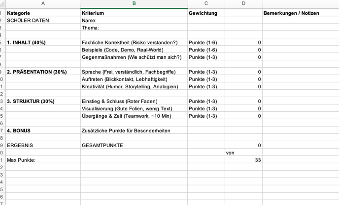

# M183 - Applikationssicherheit implementieren

[**Modulidentifikation** ICT CH](https://www.modulbaukasten.ch/module/183/3/de-DE?title=Applikationssicherheit-implementieren)

[weitere TBZ Unterlagen -> https://gitlab.com/ch-tbz-it/Stud/m183/m183](https://gitlab.com/ch-tbz-it/Stud/m183/m183)

## Themenüberblick

[Themenüberblick](https://gitlab.com/ch-tbz-it/Stud/m183/m183/-/tree/main/0%20Themen%C3%BCberblick)

- [Schutzziele "CIA"](https://gitlab.com/ch-tbz-it/Stud/m183/m183/-/blob/main/0%20Themen%C3%BCberblick/Schutzziele.md)
- [Massnahmen](https://gitlab.com/ch-tbz-it/Stud/m183/m183/-/blob/main/0%20Themen%C3%BCberblick/Massnahmen.md)

## Leistungsbeurteilungen (Prüfungen)

- LB1 (30%) Vortrag OWASP (20 min [pro Team zu 2 Personen](https://tbzedu-my.sharepoint.com/:x:/g/personal/jonas_vanessen_tbz_ch/IQARYXvWqOtzSbgFrKNkc9p0AdDFOvDBV28Oe14JReOw51k))
- LB2 (35%) Schriftliche Prüfung, `close-book`, 30-40 min [mit 2-3 Hauptfragen und 2-3 Nebenfragen aus dieser Liste](https://github.com/jonasvanessen/modules/blob/main/m183/fragenkatalog.md)
- LB3 (35%) Auftrag Penetrationstesting als Projektarbeit zu 2 Personen.  Sie machen und zeigen eine [Sicherheitsumsetzung in einer Applikation](https://gitlab.com/ch-tbz-it/Stud/m183/lb2-applikation)
  &#9997; [Auftrag-Penetrationtesting](https://github.com/jonasvanessen/modules/blob/main/m183/Auftrag-Penetrationtesting.md)

## Ablaufplan

| Tag | Datum  | Thema, Auftrag, Übung                                                                                                                                                                                                                                                                                                                                                                                                                                                                                                                                                                                                                 |
| ----- |--------| ---------------------------------------------------------------------------------------------------------------------------------------------------------------------------------------------------------------------------------------------------------------------------------------------------------------------------------------------------------------------------------------------------------------------------------------------------------------------------------------------------------------------------------------------------------------------------------------------------------------------------------------- |
| 1   | 16.02. | 📓 Themeneinstieg, Schutzziele  'Open Web Applicaiton Security Project' ([OWASP](https://gitlab.com/ch-tbz-it/Stud/m183/m183/-/tree/main/1%20OWASP)), [https://owasp.org](https://owasp.org), [Top 10](https://owasp.org/Top10)   &#9997; [LB1: Auftrag](https://github.com/jonasvanessen/modules/blob/main/m183/25-q3-1-1-ap23e-ablauf-m183.md#auftrag)                                                                                                                                                                                                                                                                         |
| 2   | 23.02. | Arbeit am LB1-Vortrag: OWASP Auftrag (Fortsetzung), Checkup/Beratung vom Lehrer                                                                                                                                                                                                                                                                                                                                                                                                                                                                                                                                                        |
| 3   | 02.03. | 📈**LB1**: [Vorträge Teams](https://tbzedu-my.sharepoint.com/:x:/g/personal/jonas_vanessen_tbz_ch/IQARYXvWqOtzSbgFrKNkc9p0AdDFOvDBV28Oe14JReOw51k)   📓 [Theorie Sessionhandling](https://gitlab.com/ch-tbz-it/Stud/m183/m183/-/tree/main/2%20Sessionhandling,%20Authentifizierung%20und%20Autorisierung/Sessionhandling) und individuelle Vertiefung   &#9997; [Auftrag Sessionhandling](https://gitlab.com/ch-tbz-it/Stud/m183/m183/-/blob/main/2%20Sessionhandling,%20Authentifizierung%20und%20Autorisierung/Sessionhandling/Auftrag.md)                                                                                 |
| 4   | 09.03. | 📈**LB1**: [Vorträge Teams](https://tbzedu-my.sharepoint.com/:x:/g/personal/jonas_vanessen_tbz_ch/IQARYXvWqOtzSbgFrKNkc9p0AdDFOvDBV28Oe14JReOw51k)   📓 Theorie: Was ist Penetrationstesting [IBM](https://www.ibm.com/de-de/topics/penetration-testing), [Wikipedia](https://de.wikipedia.org/wiki/Penetrationstest_(Informatik))    &#9997; [**LB3: Auftrag Penetrationtesting**](https://github.com/jonasvanessen/modules/blob/main/m183/Auftrag-Penetrationtesting.md)    🔏 [Sicherheitsumsetzung in einer Applikation](https://gitlab.com/ch-tbz-it/Stud/m183/lb2-applikation) oder ein selbstgewähltes Projekt |
| 5   | 16.03. | 📓 Theorie[Benutzerauthentifizierung und -autorisierung](https://gitlab.com/ch-tbz-it/Stud/m183/m183/-/blob/main/2%20Sessionhandling,%20Authentifizierung%20und%20Autorisierung/AuthentifizierungAutorisierung.md)   Weiterarbeit am [Auftrag Penetrationtesting](https://gitlab.com/harald.mueller/aktuelle.kurse/-/blob/master/m183/Auftrag-Penetrationtesting.md)                                                                                                                                                                                                                                                             |
| 6   | 23.03. | 📓Repetition[Kryptographie](https://gitlab.com/ch-tbz-it/Stud/m183/m183/-/blob/main/3%20Verschl%C3%BCsselung/README.md) (Symmetrische und asymmetrische Verschlüsselung, Hash-Methoden und digitale Signaturen)   Weiterarbeit Penetrationtesting: Check-up/Beratung für Miniprojekt/Penetrationtesting                                                                                                                                                                                                                                                                                                                        |
| 7   | 30.03. | 📓 Logging & Monitoring  Weiterarbeit Penetrationtesting   🔄️ *Austausch der Projekte und Testen des Konkurrenz-Produktes*  Check-up/Beratung für Miniprojekt/Penetrationtesting                                                                                                                                                                                                                                                                                                                                                                                                                                           |
|     |        | - Frei -                                                                                                                                                                                                                                                                                                                                                                                                                                                                                                                                                                                                                               |
| 8   | 14.04. | 📝**LB2**: Schriftliche Prüfung [siehe Fragenkatalog](https://github.com/jonasvanessen/modules/blob/main/m183/fragenkatalog.md)   Weiterarbeit Penetrationtesting *Austausch und/oder Verbesserungen vornehmen*   Check-up/Beratung für Miniprojekt/Penetrationtesting                                                                                                                                                                                                                                                                                                                                                         |
|     |        | - Frühlingsferien -                                                                                                                                                                                                                                                                                                                                                                                                                                                                                                                                                                                                                   |
| 9   | 13.04. | 🧑‍💻 e-Learning: Online-[Abgabe Miniprojekt **LB3** gemäss **Terminliste**](https://tbzedu-my.sharepoint.com/:x:/g/personal/jonas_vanessen_tbz_ch/IQARYXvWqOtzSbgFrKNkc9p0AdDFOvDBV28Oe14JReOw51k) via TEAMS                                                                                                                                                                                                                                                                                                                                                    |

 
 

# LB1: OWASP Top Ten Project (Gruppenarbeit)

## Rahmenbedingungen

Das Open Worldwide Application Security Project (OWASP) ist eine weltweite non-Profit Organisation, die sich zum Ziel setzt, Qualität und Sicherheit von Software zu verbessern. Es ist das Ziel, Entwickler, Designer, Softwarearchitekten für potenzielle Schwachstellen zu sensibilisieren und aufzuzeigen, wie sich diese vermeiden lassen. Die folgenden „[OWASP Top Ten](https://owasp.org/Top10)“ stellen unter Web-Sicherheitsexperten einen aner-kannten Konsens dar, was die derzeit kritischen Lücken in Web-Anwendungen betrifft (stand 2025):

1. [A01:2025 - Broken Access Control](https://owasp.org/Top10/2025/A01_2025-Broken_Access_Control/)
2. [A02:2025 - Security Misconfiguration](https://owasp.org/Top10/2025/A02_2025-Security_Misconfiguration/)
3. [A03:2025 - Software Supply Chain Failures](https://owasp.org/Top10/2025/A03_2025-Software_Supply_Chain_Failures/)
4. [A04:2025 - Cryptographic Failures](https://owasp.org/Top10/2025/A04_2025-Cryptographic_Failures/)
5. [A05:2025 - Injection](https://owasp.org/Top10/2025/A05_2025-Injection/)
6. [A06:2025 - Insecure Design](https://owasp.org/Top10/2025/A06_2025-Insecure_Design/)
7. [A07:2025 - Authentication Failures](https://owasp.org/Top10/2025/A07_2025-Authentication_Failures/)
8. [A08:2025 - Software or Data Integrity Failures](https://owasp.org/Top10/2025/A08_2025-Software_or_Data_Integrity_Failures/)
9. [A09:2025 - Security Logging and Alerting Failures](https://owasp.org/Top10/2025/A09_2025-Security_Logging_and_Alerting_Failures/)
10. [A10:2025 - Mishandling of Exceptional Conditions](https://owasp.org/Top10/2025/A10_2025-Mishandling_of_Exceptional_Conditions/)

## Auftrag

1. Wählen Sie OWASP Top 10 Themen aus (Anzahl Gruppenmitglieder = Anzahl zu wählender Themen), die Sie in diesem Auftrag bearbeiten möchten (jedes Thema muss von der Klasse **mind. einmal ausgearbeitet werden!**)
2. Analysieren Sie die ausgewählten Themen mit Hilfe der OWASP-Seite https://owasp.org/Top10/ (und allfälligen weiterführenden Quellen / Internetrecherche)
3. Erklären Sie in eigenen Worten, was sich hinter der Abkürzung CWE versteckt und wie CWE mit den OWASP Top 10 zusammenhängen.
4. Beschreiben Sie den Unterschied der OWASP Top 10 Risk und OWASP Proactive Control (https://owasp.org/www-project-proactive-controls/)
5. Die ausgewählten Themen werden wie folgt ausgearbeitet:
   - Beschreibung der theoretischen Hintergründe und der Bedrohung sowie mögliche Folgen
   - Schwachstelle mit konkretem Codebeispiel vorstellen und erläutern
   - Massnahme wie die Sicherheitslücke geschlossen werden kann, an einem konkreten Codebeispiel
   - Abgabe von **Dokumentation und Code Beispiele** via [GIT](https://tbzedu-my.sharepoint.com/:x:/g/personal/jonas_vanessen_tbz_ch/IQARYXvWqOtzSbgFrKNkc9p0AdDFOvDBV28Oe14JReOw51k)

## Inhalt der Dokumentation

- Überblick
- Erläuterungen zu Aufgabe 3 und 4
- Theoretische Hintergründe
- Schwachstelle mit Codebeispiel
- Massnahme mit Codebeispiel
- Resultate, Erkenntnisse
- Hinweise auf weitere Unterlagen, Übungen, Tutorien (inkl. **verwendeter Quellen**)

## Zeitrahmen

Als Vorbereitung stehen 7 Lektionen während der Schule zur Verfügung. Die Vorstellung soll die Problemstellung (Angriffspunkt, Auswirkung, Technologie) und Lösung (Technologie und sinnvolle Gegenmassnahmen) anhand von praktischen Beispielen (Live Demo der Codebeispiele – keine PowerPoint), aufzeigen. Die Live Demo darf pro Thema maximal 7 Min dauern und ist in Standardsprache zu halten.

## Resultat

- Vollständiger schriftlicher Theorie Teil mit praktischen Code-Beispielen.
- Live Demo anhand von Beispielen von Sicherheitslücken und geeignete OWASP Gegenmassnahmen.

## Termine, Abgabe

Die konkreten Termine und Abgabemodalitäten werden durch die Lehrperson für jede Moduldurchführung individuell festgelegt und entsprechend kommuniziert.

## Bewertung Präsentation

Feb 26, VAJ
