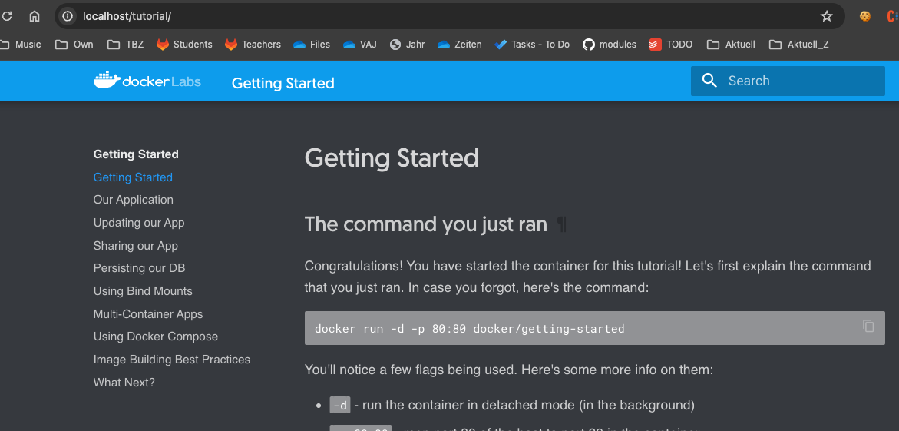
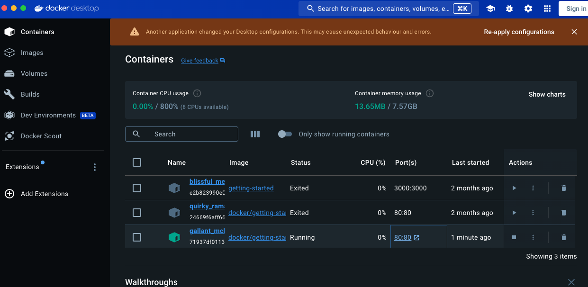
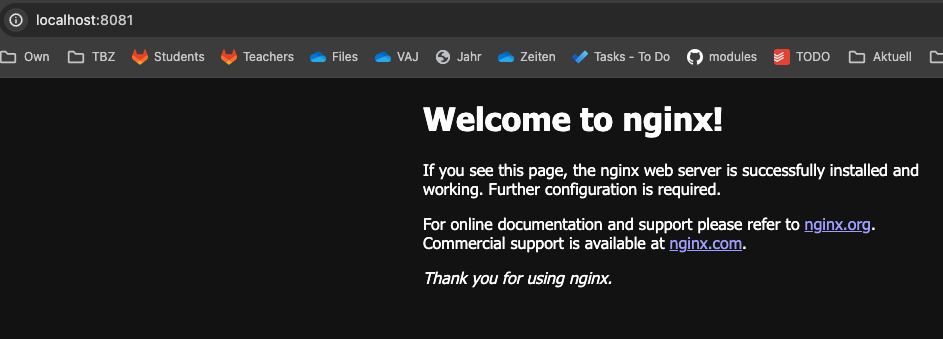
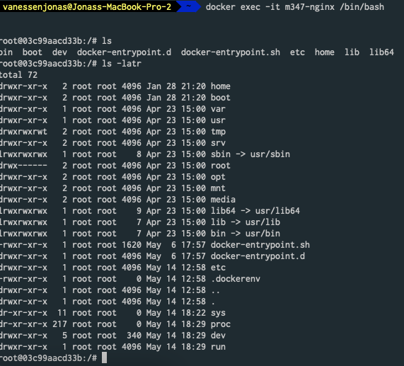
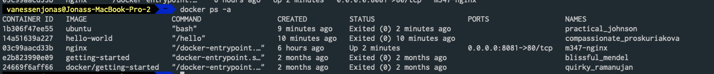
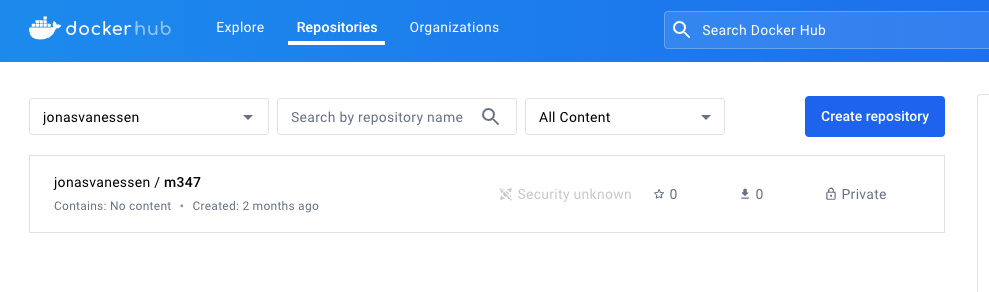
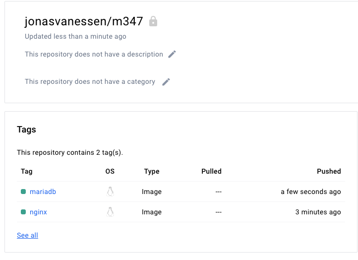

# A)

App im Browser


Docker Desktop


# B)

```
# version
docker -v 

# lists all ubuntu images
docker search ubuntu 

# run -> Kreiert und lässt ein image laufen (pull-create-start)
# -d -> lässt den container im Hintergrund laufen und printet die container ID
# -p exponiert den port Bsp: 8081:80 -> 8081 im Browser vom Host eingeben der den Port 80 vom Container exponiert
docker run -d -p 80:80 docker/getting-started

# Laedt das default tag (latest) vom nginx image runter
docker pull nginx

# NGINX
# Erstellt einen container aus einem image
docker create --name m347-nginx -p 8081:80 nginx
docker start m347-nginx


# UBUNTU
# Wir zeigen, dass nicht jedes Image im Hintergrund ausgeführt werden kann
# Docker container lives while command is running.
# So when you closing terminal command (aka container entrypoint) container stops.
# If your image does not have a default command set to run on startup (in your Dockerfile) you have to provide one yourself 
# You didn't specify a command so the container runs with the default command bash. If you run bash interactively (-ti) it stays open, but otherwise it quits immediately.
docker run -d ubuntu --name m347-ubuntu
# to run it
docker run -it ubuntu bash


# NGINX
docker exec -it m347-nginx /bin/bash

# Status von containers
docker ps -a

# Container stoppen
docker stop 03c99aacd33b

# Alle beendeten Container löschen:
docker rm $(docker ps --filter status=exited -q)

# Image löschen
docker rmi ubuntu
```


## -it vs -d
```
-i (interactive) is about whether to keep stdin open (some programs, like bash, use stdin and other programs don't). -d (detached) is about whether the docker run command waits for the process being run to exit. Thus, they are orthogonal and not inherently contradictory. A program like bash exits when stdin is closed, so without -i, it exits immediately.

-t (tty) allocates a pseudo-tty. You can see the difference from running bash with -it vs with just -i. For example, without -t, you don't get any prompt and ls shows results in one column. This difference is like the difference between running ls from a normal bash session and running ls | cat from a normal bash session, where cat does not have a pseudo-tty.
```

## Printscreens
Nginx gestartet


Nginx 
Shell aktivem Containers



Status von Containers



# C)


# D)
´´´
docker pull nginx # nginx herunterladen
                                                                

docker tag nginx:latest jonasvanessen/m347:nginx # erstellt einen neuen Tag für das gleiche Image. Der Tag kann als "Speicherort" angesehen werden.
docker login  -u jonasvanessen
docker push jonasvanessen/m347:nginx # lädt das image in das Repository hoch
docker search mariadb
docker pull mariadb
docker tag mariadb:latest jonasvanessen/m347:mariadb
docker push jonasvanessen/m347:mariadb
´´´

