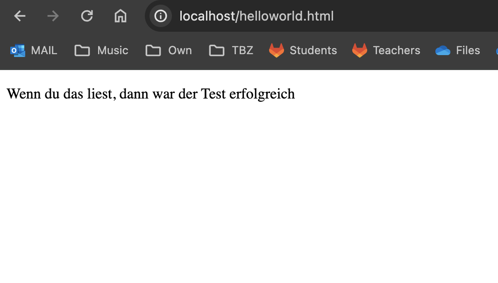
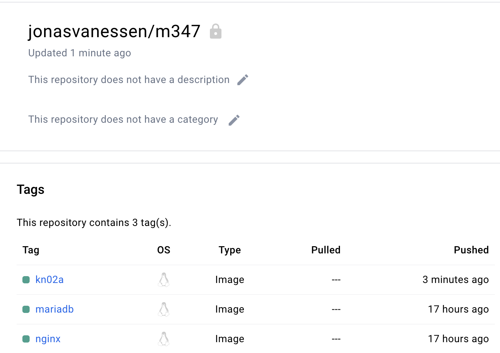

# A)
```
# Welches Base Image von hub.docker.com verwendet werden soll, z.B. ubuntu:16.04
FROM nginx  # ...
# Wird verwendet, um Dateien aus dem Build Context in das Image zu kopieren. Es gibt die zwei Formen COPY src dest und COPY ["src", "dest"]. Das JSON-Array-Format ist notwendig, wenn die Pfade Leerzeichen enthalten.
COPY static-html-directory /var/www/html # ...
# Erklärt Docker, dass der Container einen Prozess enthält, der an dem oder den angegebenen Port(s) lauscht.
EXPOSE 	80	# ...


docker build -t jonasvanessen/m347:kn02a .
docker push jonasvanessen/m347:kn02a
docker run -d -p 80:80 jonasvanessen/m347:kn02a
```




# B)


