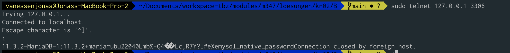
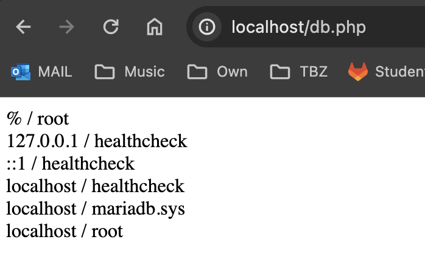

# B)

## DB

´´´
# Build
docker build -t jonasvanessen/m347:kn02b-db .
docker run --name m347-kn02b-db -d -p 3306:3306 jonasvanessen/m347:kn02b-db

# Push
docker push jonasvanessen/m347:kn02b-db
´´´

## WEB

´´´
docker build -t jonasvanessen/m347:kn02b-web .
docker run --name m347-kn02b-web -d -p 80:80 --link m347-kn02b-db jonasvanessen/m347:kn02b-web

´´´

