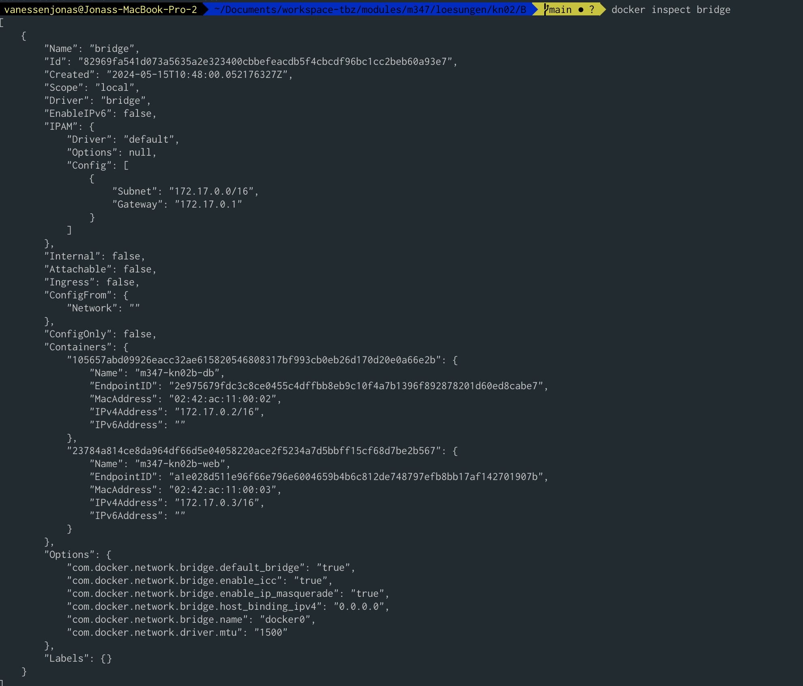
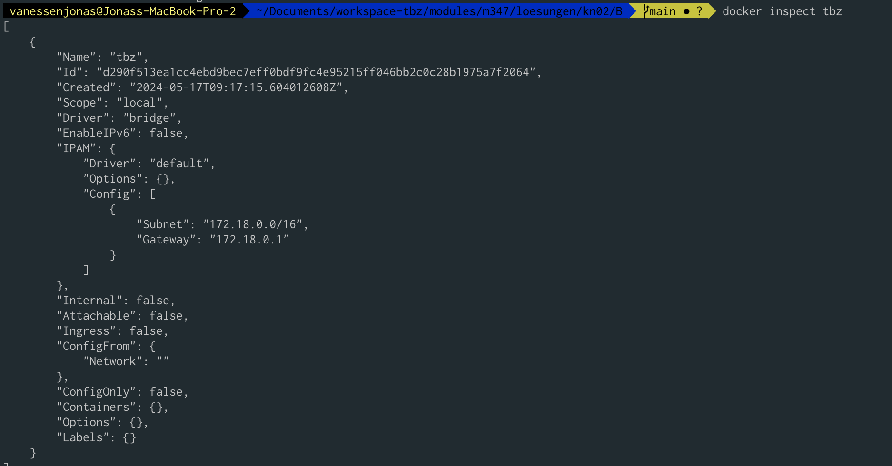
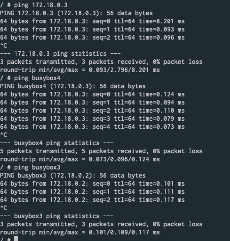

# A)

```
# Create network
# Apparently Docker uses the following ranges by default:
# 172.17.0.0/16", 172.18.0.0/16", "172.19.0.0/16", "172.20.0.0/14", "172.24.0.0/14" "172.28.0.0/14", "192.168.0.0/16".
docker network create tbz
docker network ls
docker inspect tbz


docker run --name busybox1 -it -p 8001:80 busybox # 172.17.0.2
docker run --name busybox2 -it -p 8002:80 busybox # 172.17.0.3
docker run --name busybox3 -it -p 8003:80 --network tbz busybox # 172.18.0.2
docker run --name busybox4 -it -p 8004:80 --network tbz busybox # 172.18.0.3

# busybox1 -> ping 172.17.0.3 works (busybox2)
# busybox1 -> ping busybox2 DOES NOT WORK

# busybox3 -> ping 172.18.0.3 works (busybox4)
# busybox3 -> ping busybox4 works

# IP Specific
docker network create --subnet=172.18.0.0/16 tbz # creates the network with the name 'tbz' Subnet in CIDR format that represents a network segment


# The -it flag combines both -i and -t together — which keeps STDIN open and allocates a pseudo-tty. This -ttytells Docker to create a virtual terminal session within your container. Using the --rm flag tells Docker to tidy up your container and remove the filesystem when it exits.

# The issue is that the busybox container doesn't have a default long-running process and exits immediately after completing its task. To keep the container running, you can specify a command that will keep it active. One common approach is to run a shell in an infinite loop or use a command that keeps the container alive. Here are two examples:


# Check IP's
docker inspect busybox1 | grep IP
```

## Namensauflösung

* Die Netzwerk funktionieren grundsätzlich gleich, aber mit dem Unterschied, dass die Namensauflösung im eigenen Netzwerk [user-defined bridges](https://docs.docker.com/network/drivers/bridge/#differences-between-user-defined-bridges-and-the-default-bridge) funktioniert. Hinweis: Automatische DNS Auflösung zwischen containers.
* In KN02 hatten wir den Parameter --Link verwendet, damit die beiden Container miteinander kommunizieren konnten. Da die Namensauflösung im Default Bridge nicht funktioniert war dies notwendig.







