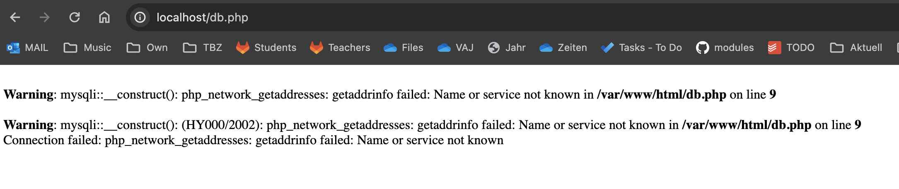

# KN-04

# A)

```
# docker-compose version -> obsolete
# https://stackoverflow.com/questions/76156527/what-does-the-first-line-in-the-docker-compose-yml-file-that-specifies-the-ve

# Builds, (re)creates, starts, and attaches to containers for a service.
docker-compose up

# docker compose -f "path-to-your-yaml" up 
# => Dokumentation: https://docs.docker.com/engine/reference/commandline/compose_up/
# steht für: Builds, (re)creates, starts, and attaches
docker compose build # build the services, similar to docker build
docker compose create # creates the containers
docker compose start # starts the created containers
docker compose attach # attaches the input and output to your console

# PHP File Info
# 'REMOTE_ADDR' -> The IP address from which the user is viewing the current page.
# 'SERVER_ADDR' -> The IP address of the server under which the current script is executing.
# Src: https://www.php.net/manual/en/reserved.variables.server.php#:~:text='%20REMOTE_ADDR%20',the%20REMOTE_ADDR%20of%20the%20user.


```





Erklärung zum Fehler: In KN02 hatten wir in db.php hardkodierte Werte eingetragen für den verlinkten Server. Da unser DB-Container nun einen anderen Namen hat, funktioniert diese Einstellung nicht mehr.

Eine Mögliche Lösung ist, hier Environment-Variablen zu verwenden und diese dann beim Erstellen des Containers anzugeben (via Docker Compose Anweisung). Man muss dafür aber zuerst ein neues Image mit der entsprechenden Änderung in das private Repository pushen oder wieder direkt mit dem build-Befehl in Docker-Compose arbeiten.

```
<?php
	$servername = $_ENV['DBSERVER'];
	// 	Alternative: $servername = $_SERVER['DBSERVER'];
	// 	Alternative: $servername = getenv("DBSERVER");
	$username = "root";
	// Mehr Code
?>

```

# B) Docker Compose: Cloud


