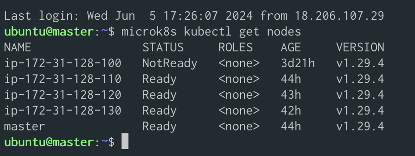
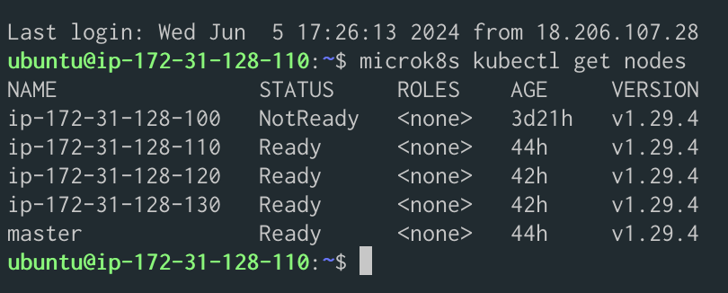
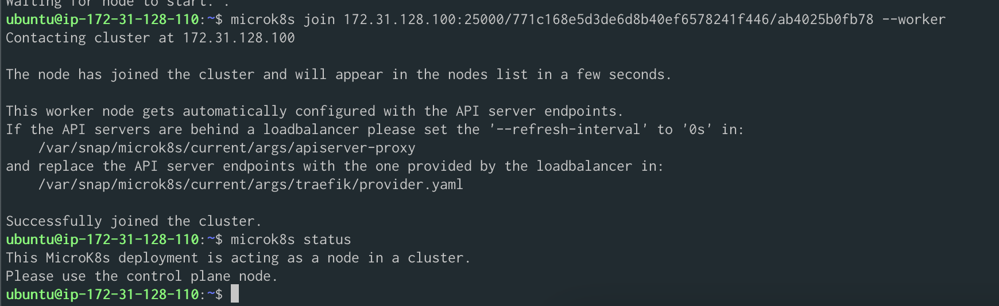
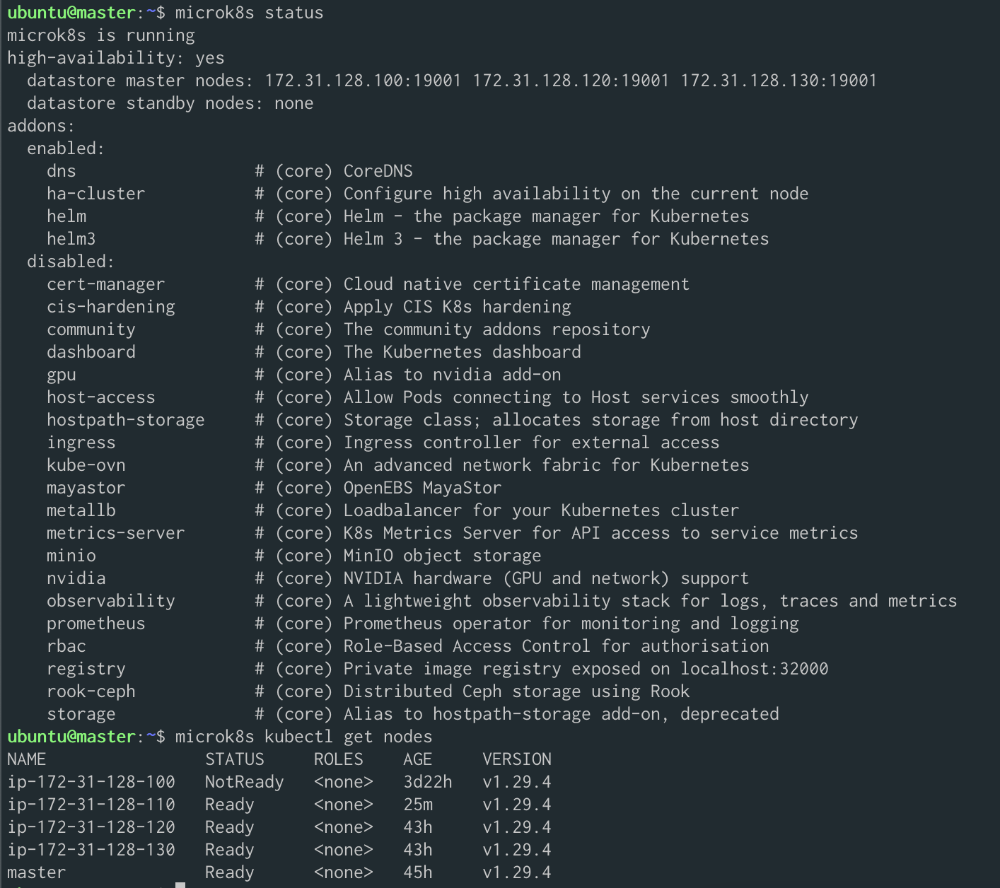
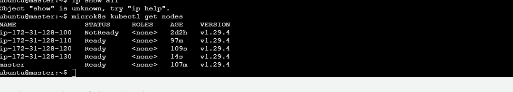

# B)

Master:



Node 1
```
microk8s kubectl get nodes
```



```
# master
microk8s status

microk8s is running
high-availability: yes
  datastore master nodes: 172.31.128.110:19001 172.31.128.120:19001 172.31.128.130:19001
  datastore standby nodes: 172.31.128.100:19001

# node-1
microk8s is running
high-availability: yes
  datastore master nodes: 172.31.128.110:19001 172.31.128.120:19001 172.31.128.130:19001
  datastore standby nodes: 172.31.128.100:19001  
```

> A highly available Kubernetes cluster is a cluster that can withstand a failure on any one of its components and continue serving workloads without interruption

Source: https://microk8s.io/docs/high-availability

Um einen zu entfernen
```
# Auf dem node den man entfernen will
microk8s leave

# The node will be marked as ‘NotReady’ (unreachable) in Kubernetes. To complete the removal of the departing node, issue the following on any of the remaining nodes:


# Auf dem master
microk8s remove-node <node>
```

Status auf dem Worker node


Node-1 ist im status nicht mehr aufgelistet



microk8s: Verwende diesen Befehl, um das MicroK8s-System selbst zu verwalten. Dies umfasst das Installieren, Starten, Stoppen und Verwalten von Add-ons innerhalb von MicroK8s.

```
Beispiel: microk8s start, microk8s stop, microk8s enable dns
```

microk8s kubectl: Verwende diesen Befehl, um mit dem Kubernetes-Cluster zu interagieren, das von MicroK8s bereitgestellt wird. Dies umfasst das Verwalten von Ressourcen innerhalb des Clusters, wie Pods, Deployments, Services usw.
```
Beispiel: microk8s kubectl get pods, microk8s kubectl apply -f my-deployment.yaml
```


